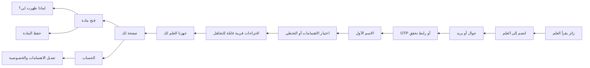

# عضوية العلم — القرار المعماري والتنفيذ المرحلي

> الحالة: **النواة التشغيلية مطبقة**. التسجيل والجلسات عبر Neon Auth، وملف العضو واهتماماته وصفحة «لك» مطبقة في قاعدة مستقلة عن مستخدمي التحرير. يبقى الحفظ والإشارات السلوكية ضمن المراحل التالية.

## 1. الخلاصة التنفيذية

التوصية هي بناء **عضوية جمهور مستقلة** عن مستخدمي «تحرير العلم»، مع فصل المسؤوليات كالتالي:

- مزوّد هوية مُدار يتولى OTP والبريد والجلسة ومنع الإساءة واستعادة الحساب.
- «العلم» يمتلك ملف العضو واهتماماته الصريحة وإشارات القراءة والحفظ والتوصيات.
- واجهة `MemberAuth` داخلية تمنع ارتهان المنتج لمزوّد واحد؛ اختيار المزوّد النهائي يمر بتقييم الإقامة والخصوصية ودعم رسائل السعودية والتكلفة.
- محرك ترتيب حتمي وقابل للتفسير في البداية؛ الذكاء الاصطناعي يقترح الصلات والموضوعات ولا ينشر ولا يقرر وحده.

السبب: بناء OTP والجلسات والحماية من الاستيلاء على الحساب من الصفر لا يخلق قيمة تحريرية، ويرفع المخاطر. أما الاهتمامات والتوصيات فهي جوهر تجربة «العلم» ويجب أن تبقى تحت سيطرة المنصة.

## 2. ما وجدناه في المشروع

- الواجهة العامة مبنية على Next.js App Router وRSC، بهوية RTL ورموز تصميم مركزية في `app/globals.css`.
- المحتوى العام يمر عبر عقد `ContentProvider` ولا يعرض إلا المواد المنشورة، مع مصدر بديل محلي.
- لوحة «تحرير العلم» تملك جدول `users` وجلسة موقعة وأدوارًا تحريرية. **لا يجوز إعادة استخدامها للأعضاء**؛ جمهور المنصة له نطاق تهديد وصلاحيات ودورة حياة مختلفة.
- جداول ملف العضو والاهتمامات مطبقة في `db/schema.ts` ومنفصلة عن مستخدمي التحرير.
- ميزانية JavaScript الحالية 200 KiB مضغوط؛ النموذج بلا مكتبة واجهات أو تبعية جديدة.

## 3. رحلة المستخدم المقترحة



مبادئ الرحلة:

1. الانضمام ليس جدارًا أمام القراءة؛ الزائر يستطيع الاستمرار بلا حساب.
2. اختيار الاهتمامات اختياري، مع توضيح أثره، ويمكن تغييره لاحقًا.
3. صفحة «لك» ليست فقاعة: جزء من الترتيب صريح، وجزء تحريري، وجزء استكشافي.
4. «لماذا ظهرت لي؟» يشرح السبب بلغة بشرية دون ادعاء دقة زائفة.
5. إيقاف التخصيص ومسح الإشارات المستنتجة متاحان، ولا يمسحان الاختيارات الصريحة إلا بأمر منفصل.

## 4. مخطط البيانات — تنفيذ مرحلي

المطبق الآن هو `member_profiles` و`interests` و`member_interests`. بقية الجداول أدناه خارطة توسع وليست migration منفذة بعد.

| الجدول | الحقول الأساسية | الفهارس والقيود |
|---|---|---|
| `members` | `id uuid`, `display_name`, `status`, `locale`, `created_at`, `last_seen_at`, `deleted_at` | فهرس الحالة؛ حذف منطقي قبل المحو |
| `member_identities` | `id`, `member_id`, `provider`, `provider_subject`, `kind`, `masked_value`, `verified_at` | `unique(provider, provider_subject)`؛ لا نخزن OTP |
| `member_preferences` | `member_id`, `personalization_enabled`, `notifications`, `content_density`, `updated_at` | صف واحد لكل عضو |
| `interests` | `id`, `slug`, `label_ar`, `kind`, `parent_id`, `status`, `editorial_weight` | `unique(slug)`؛ taxonomy مرنة لا تعتمد الأقسام فقط |
| `member_interests` | `member_id`, `interest_id`, `source`, `weight`, `created_at`, `updated_at` | `unique(member_id, interest_id, source)`؛ `source=explicit` مستقل عن `inferred` |
| `member_signals` | `id`, `member_id`, `story_id`, `event_type`, `strength`, `occurred_at`, `expires_at` | فهرس العضو والزمن؛ مدة احتفاظ محدودة |
| `saved_stories` | `member_id`, `story_id`, `saved_at` | مفتاح مركب؛ الإشارة إلى المادة لا نسخة منها |
| `followed_entities` | `member_id`, `entity_type`, `entity_id`, `followed_at` | أنواع: سلسلة، كاتب، موضوع |
| `recommendation_impressions` | `id`, `member_id`, `story_id`, `reason_code`, `position`, `model_version`, `shown_at` | قياس جودة الترتيب والتنوع؛ دون نص حساس |
| `member_consents` | `id`, `member_id`, `purpose`, `version`, `granted_at`, `revoked_at` | سجل موافقة قابل للتدقيق |

حدود واضحة:

- لا علاقة أو FK بين `members` وجدول مستخدمي التحرير.
- مزوّد الهوية هو مصدر حقيقة لإثبات الهوية فقط؛ Postgres مصدر حقيقة للملف والتفضيلات.
- لا يُخزن رقم الجوال/البريد كنص قابل للعرض إلا إذا احتاج المنتج ذلك وبعد تشفير مناسب؛ واجهة الحساب تعرض قيمة مقنّعة.
- حذف الحساب عملية مدققة: تعطيل فوري، إلغاء الجلسات، ثم محو/إخفاء الهوية وفق سياسة احتفاظ معتمدة.

## 5. منطق التخصيص في النسخة الأولى

### المرشحون

مواد `published` فقط، مع استبعاد المكرر والمنتهي والسياسة التحريرية غير المناسبة. لا يستطيع نموذج ذكاء اصطناعي إدخال مادة غير منشورة إلى القائمة.

### ترتيب أولي قابل للتفسير

`score = اهتمام صريح + حداثة + أهمية تحريرية + ملاءمة الصيغة - تكرار الموضوع`

- الاهتمام الصريح أعلى وزنًا من السلوك المستنتج.
- الإشارة المستنتجة تتناقص مع الزمن ولها تاريخ انتهاء.
- 20–30% من الصفحة للمهم تحريريًا والاستكشاف المتنوع، لضبط فقاعة الترشيح.
- كل ظهور يحمل `reason_code` ثابتًا مثل: `explicit_interest`, `editorial_pick`, `followed_series`, `discovery`.

### دور الذكاء الاصطناعي

- مقترح وسوم وصلات بين المادة وtaxonomy، بعد قبول/تدقيق تحريري.
- اقتراح اهتمامات مجاورة أثناء الإعداد، ولا تُضاف دون ضغط المستخدم.
- توليد صياغة قصيرة لشرح السبب من رموز أسباب موثوقة، مع fallback حتمي جاهز.
- ممنوع: تعديل متن المادة، استنتاج سمات حساسة، أو اتخاذ قرار نشر.

عند تعطل الذكاء: تُعرض الأحدث واختيارات المحررين والترتيب الحتمي، مع رسالة هادئة؛ لا صفحة فارغة.

## 6. الهوية والجلسات والأمان

قرار هذه المرحلة: **مزوّد مُدار خلف adapter**، وليس نظام مصادقة مخصصًا.

متطلبات بوابة الاختيار قبل التعاقد:

- OTP للجوال السعودي والبريد، حماية brute force وSIM-swap قدر الإمكان، وربط الحسابات المتكررة.
- جلسة HttpOnly وSecure وSameSite مناسبة، تدوير refresh، وإلغاء كل الجلسات.
- Webhooks موقعة وقابلة لإعادة المحاولة، وبيئة اختبار مستقلة.
- DPA، موقع معالجة البيانات، آلية حذف/تصدير، سجلات تدقيق، وتكلفة متوقعة عند النمو.
- إمكانية نقل الهوية أو استخدام subject داخلي ثابت؛ لا تُسرّب معرفات المزوّد داخل منطق المنتج.

ضوابط التطبيق:

- رسائل عامة تمنع كشف وجود الحساب، وقيود إرسال حسب الهوية وIP والجهاز.
- OTP قصير العمر، محاولة محدودة، إعادة إرسال مؤقتة، ولا يسجل في logs.
- CSRF للعمليات الحساسة، CSP، تحقق server-side، وتدقيق لأحداث تغيير الهوية والخصوصية.
- العضو العادي لا يملك أي مسار أو claim من أدوار التحرير.

## 7. الحالات والاسترجاع

| الحالة | السلوك |
|---|---|
| تخطي الاهتمامات | بداية من اختيارات المحررين والأهم، مع دعوة غير ملحّة للتخصيص |
| اهتمام واحد | ترتيب خفيف مع تنويع أعلى وعدم الادعاء بدقة كبيرة |
| اهتمامات كثيرة | تجميع متوازن يمنع سيطرة موضوع واحد |
| لا محتوى مناسب | شرح صريح، توسيع الاهتمامات أو فتح اختيارات المحررين |
| غير مسجل | القراءة متاحة؛ الحفظ يفتح انضمامًا يحفظ نية المستخدم |
| جلسة منتهية | حفظ الصفحة والنوايا محليًا مؤقتًا، ثم تسجيل دخول وإكمال آمن |
| OTP فاشل | خطأ موضعي، عداد إعادة إرسال، تغيير القناة، وحماية من الإفراط |
| حساب موجود | ربط المستخدم بحسابه دون كشفه لطرف آخر |
| اتصال ضعيف | skeleton خفيف، صور كسولة، إعادة محاولة، وعدم فقد الاختيارات |
| AI متعطل | ترتيب حتمي + تحريري بلا تعطيل للمنتج |
| عضو جديد | onboarding تدريجي، ولا صفحة خاوية أو «تخصيص وهمي» |

## 8. القياس

أحداث الحد الأدنى، بأسماء ثابتة وبدون محتوى الهوية:

- `membership_join_clicked`
- `membership_method_selected`
- `membership_otp_requested`, `membership_otp_verified`, `membership_otp_failed`
- `onboarding_started`, `interest_selected`, `interests_skipped`, `onboarding_completed`
- `personal_feed_viewed`, `recommendation_impression`, `recommendation_opened`
- `recommendation_reason_opened`
- `story_saved`, `story_unsaved`
- `interests_edited`, `personalization_disabled`, `inferred_signals_cleared`
- `session_expired`, `recommendation_fallback_served`

مقاييس القرار: إكمال الانضمام، إكمال اختيار الاهتمامات، فتح مادة من «لك»، الحفظ، العودة خلال 7/30 يومًا، تنوع الأقسام، نسبة fallback، وشكاوى/إلغاء التخصيص. لا نعتمد CTR وحده لأنه يكافئ الإثارة أكثر من المعرفة.

## 9. خطة التنفيذ بعد الاعتماد

1. **قرار المالك**: الاسم، قنوات الدخول، مزوّد الهوية، سياسة الخصوصية والاحتفاظ، وحدود MVP.
2. **عقد وتجربة**: `MemberAuth` adapter وبيئة sandbox؛ threat model واختبارات OTP والجلسات.
3. **بيانات العضوية**: migration مستقلة بعد مراجعة DBA، تشفير ونسخ احتياطي وحذف/تصدير.
4. **MVP**: انضمام، اهتمامات صريحة، صفحة «لك»، الحفظ، الحساب، أسباب ثابتة، وقياس.
5. **إطلاق متدرج**: موظفون، 1%، 10%، ثم توسع؛ بوابة rollback ومراقبة الأخطاء والجودة والتنوع.
6. **تعلم مضبوط**: إشارات مستنتجة محدودة، تقييم offline، اختبار A/B أخلاقي، ثم AI مساعد فقط إن أثبت قيمة.

## 10. قرارات مطلوبة من مالك المنتج

1. اسم الوجهة: **«لك»** (موصى به) أم «العلم لك» أم «اهتماماتك»؟
2. MVP: جوال فقط، أم جوال + بريد؟ التوصية: القناتان مع أولوية الجوال في السعودية.
3. هل الحفظ يتطلب حسابًا فورًا أم يسمح بقائمة محلية مؤقتة؟ التوصية: محلي مؤقت ثم دمج بعد الدخول.
4. هل التخصيص مفعّل افتراضيًا بعد اختيار الاهتمامات؟ التوصية: نعم بموافقة واضحة، والإشارات المستنتجة اختيار مستقل.
5. مدة الاحتفاظ بإشارات القراءة المستنتجة: التوصية الأولية 90 يومًا، وتحتاج اعتماد الخصوصية.
6. نطاق الإطلاق الأول: الاهتمامات + الحفظ فقط؛ متابعة الكاتب/السلسلة والتنبيهات تؤجل للمرحلة التالية.

## 11. طريقة معاينة النموذج

محليًا في وضع التطوير:

```bash
npm run dev
# افتح /prototype/membership
```

المسار يعطي 404 في production افتراضيًا. يمكن فتحه في **بيئة Preview مخصصة فقط** بوضع `MEMBERSHIP_PROTOTYPE=1`. لا يُنصح بوضع المتغير في الإنتاج العام.
