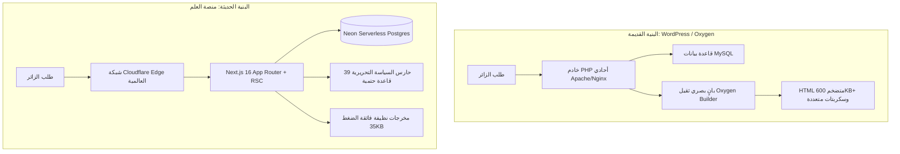
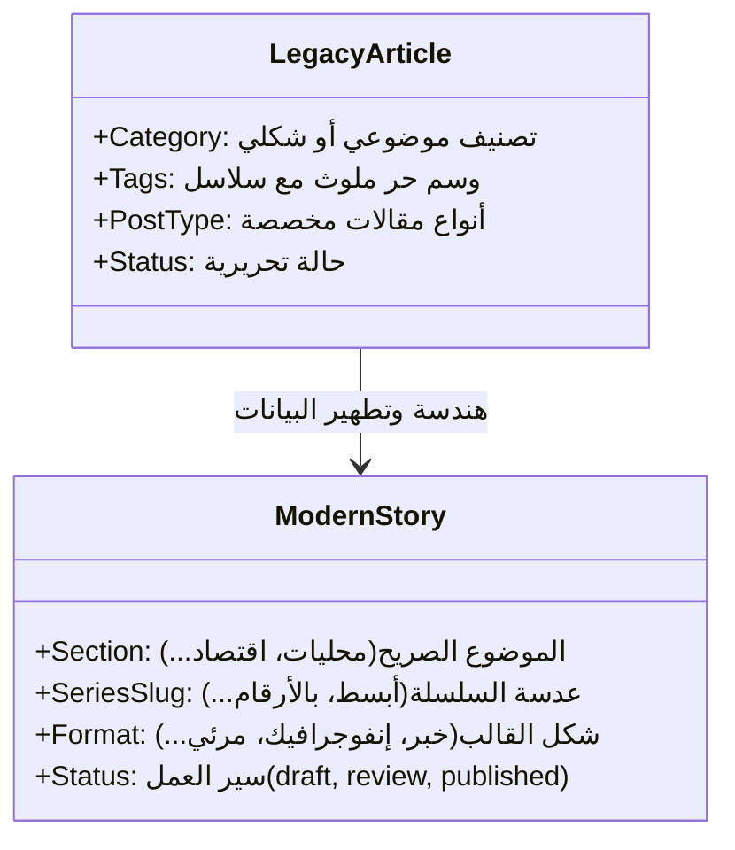

# خطة ترحيل البيانات والمحتوى ومصفوفة الفروقات المعمارية
### من بيئة ووردبريس القديمة إلى منصة «العلم» السيادية الحديثة

> [!IMPORTANT]
> **الهدف الاستراتيجي:** ترحيل **29,069 مادة صحفية** و **96,959 ملف وسائط** من نظام ووردبريس الموروث إلى منصة العلم الجديدة المستقلة والمبنية على تقنيات الحافة (Edge-First)، مع **ضمان 100% لبقاء الروابط وصفر فقدان في الـ SEO والترتيب في محركات البحث**.

---

## 1. مقارنة البنية التقنية (Architectural Benchmark)

نقلة نوعية من بنية أحادية قديمة (Monolithic PHP/MySQL) إلى بنية موزعة فائقة السرعة والأمان (Distributed Serverless/RSC):



### مصفوفة الفروقات التقنية والأداء:

| المعيار الفني | البيئة القديمة (Legacy WordPress) | منصة العلم الجديدة (Modern Platform) | الأثر الإيجابي |
|---|---|---|---|
| **المكدس الأساسي** | PHP 8.x + MySQL + WordPress | Next.js 16 (React 19) + TypeScript + Neon Postgres | استقرار هندسي وتحكم كامل بالكود |
| **محرك التصيير** | Server-Side Rendering عبر PHP | React Server Components (RSC) على الحافة | تحميل صفري لجافاسكربت الواجهة في أغلب المكونات |
| **بناء الصفحات** | Oxygen Builder 4.9.2 (أكواد متداخلة) | Vanilla CSS + Design System «المنشور» الصارم | سرعة معالجة وخلو من الكود الفائض |
| **زمن أول بايت (TTFB)** | 560ms – 900ms | **< 80ms** (عبر Cloudflare Edge Cache) | استجابة فورية للزوار وروبوتات الزحف |
| **حجم الصفحة (HTML/JS)** | 601KB HTML + 657KB JS | **< 35KB HTML + < 140KB JS** | انخفاض استهلاك البيانات بنسبة 85% |
| **مؤشرات الويب الحيوية (LCP)** | 3.2s – 4.5s (منطقة حمراء/صفراء) | **< 1.1s** (منطقة خضراء مثالية) | تصدر نتائج بحث Google وملاءمة الهاتف |
| **التحكم بالسياسة التحريرية** | يدوي / عشوائي / لا حظر برمجي | محرك «حارس السياسة» (39 قاعدة حتمية) | حماية كاملة من المخالفات والأخطاء اللغوية |
| **تخزين الوسائط** | استضافة محلية تقليدية على القرص | Cloudflare R2 + ضغط وتحويل تلقائي WebP | توفير 70% من التخزين وسرعة تحميل مضاعفة |

---

## 2. جرد البيانات وتفكيك الأبعاد الأربعة (Data Inventory)

### أ. حجم الأرشيف المنقول:
* **المواد الصحفية (`posts`):** `29,069` مادة.
  - منها **`25,423`** مادة منشورة وحية.
  - **`930`** مادة معتمدة.
  - **`869`** مسودة وقيد التعديل.
* **الوسائط والملفات (`media`):** `96,959` ملفاً (صور، رسوم، مستندات).
* **التصنيفات الأساسية:** `16` قسماً موضوعياً.

### ب. النقلة المعمارية: فصل الأبعاد الأربعة
في النظام القديم، كانت التصنيفات والوسوم وقوالب النشر متداخلة. في منصة «العلم» تم تفكيكها إلى 4 كيانات مستقلة:



1. **الموضوع (`section`):** واحد إلزامي يحدد التخصص الموضوعي للمادة.
2. **العدسة (`seriesSlug`):** سلسلة تحريرية اختيارية من سلاسل العلم الثمانية.
3. **الشكل (`format`):** طبيعة إخراج المادة (`news`, `infographic`, `video`, `report`, `podcast`).
4. **سير العمل (`status`):** حالة المادة في دورة النشر مع تدقيق حارس السياسة.

---

## 3. خريطة مطابقة الحقول (Field Mapping Matrix)

| حقل ووردبريس القديم | حقل منصة العلم (`db/schema.ts`) | آلية التحويل والمعالجة |
|---|---|---|
| `ID` | `stories.id` | **يُحفظ المعرف الرقمي كما هو حرفياً (المفتاح الأساسي لبقاء الروابط)** |
| `slug` | `stories.slug` | تنظيف الترميز مع الإبقاء على البنية النصية للعناوين |
| `title.rendered` | `stories.title` | فك كيانات HTML والتنظيف من محارف التنسيق الزائدة |
| `content.rendered` | `stories.body` | تجريد أكواد Oxygen القصيرة إلى كتل فقرات وHTML دلالي نظيف |
| `excerpt.rendered` | `stories.excerpt` | إزالة وسوم التنسيق وتوليد مقتطف مركز لا يتجاوز 180 حرفاً |
| `categories` | `stories.section` | التحويل عبر جدول مطابقة الأقسام (الموضوعي يغلب الشكلي) |
| `tags` (السلاسل) | `stories.seriesSlug` | استخلاص وسوم السلاسل الثمانية وعزل الوسوم العشوائية الملوثة |
| `article_type` | `stories.format` | تعيين شكل المادة (خبر / إنفوجرافيك / مرئي / تقرير) |
| `featured_media` | `stories.image` + `media` | ربط الصورة الأصلية وتوليد مسار CDN المحسن |
| `date_gmt` | `stories.publishedAt` | تحويل التاريخ إلى صيغة ISO 8601 القياسية |
| `modified_gmt` | `stories.updatedAt` | حفظ تاريخ آخر تعديل دقيق |
| `post_author` | `stories.authorName` | تعيين اسم المحرر وربطه بحسابات التحرير |

---

## 4. ضمانات الـ SEO المطلقة (Zero-SEO-Loss Strategy)

> [!TIP]
> **قاعدة الذهب:** المحافظة على هيكل الروابط بنسبة 100% تضمن استمرار تدفق الزوار من Google دون هبوط في الزيارات أو ظهور أخطاء `404 Not Found`.

### أ. تطابق بنية الروابط (1:1 URL Structure):
بنية الروابط في منصة العلم مصممة لتكون مطابقة لبنية الأرشيف السابقة:
$$\text{URL} = \texttt{https://alelm.net/\{section\}/\{id\}/\{slug\}}$$

### ب. طبقة التحويلات الذكية (Wildcard 301 Resolvers):
لحماية الروابط التي قد تطلب بقسم قديم أو سلاج معدل:
1. **قاعدة الـ ID يحسم:** أي طلب يطابق `/*/:id/*` يتم التعرف على المادة من خلال معرّفها `id` وتوجيه الزائر فوراً بتحويل دائم `301 Permanent Redirect` إلى مسارها الرسمي الحالي.
2. **تحويلات الوسوم والسلاسل:** توجيه تلقائي من `/tag/:series_name` إلى المسار الحديث `/series/:slug`.
3. **تصدير وإدماج تحويلات Rank Math القديمة:** دمج كافة قواعد التحويل السابقة في Middleware خفيف على الحافة.

### ج. البيانات المهيكلة وخرائط الموقع:
* توليد مخطط **`NewsArticle JSON-LD`** لكل مادة يشمل الكاتب، الناشر، تاريخ النشر والتعديل، والصور.
* إنشاء خريطتي موقع:
  - **`sitemap-news.xml`**: لمقالات آخر 48 ساعة لفهرسة جوجل الإخبارية السريعة.
  - **`sitemap.xml`**: الشاملة لكافة الأقسام والسلاسل والمواد الدائمة.

---

## 5. خطة مراحل الترحيل التنفيذية (Migration Phases)

````carousel
### المرحلة 0: الإعداد والجرد الآلي (M0)
- قراءة أرشيف ووردبريس عبر REST API الآمن ومطابقة الجرد.
- إنشاء مجلد البيانات المعزول وتجهيز سكربتات التحويل والتنظيف.
- اختبار 0% تعديل على بيئة الإنتاج القديمة (Read-Only Mode).
<!-- slide -->
### المرحلة 1: البروفة الموسعة (M1 Rehearsal)
- ترحيل عينة حية تضم **500 مادة** منوعة (أخبار، إنفوجرافيك، مرئي، سلاسل).
- التحقق من مطابقة الروابط بنسبة 100% وخلو الصور من الروابط المكسورة.
- فحص المواد عبر «حارس السياسة التحريرية» للتأكد من المعايير.
<!-- slide -->
### المرحلة 2: ترحيل كامل الأرشيف (M2 Full Ingestion)
- استيراد الـ 29,069 مادة إلى قاعدة بيانات **Neon Postgres** عبر سكربت `db-seed`.
- نقل وتحسين الصور النشطة ورفعها إلى **Cloudflare R2**.
- بناء فهارس البحث والتصنيفات وتوليد الكاش المسبق.
<!-- slide -->
### المرحلة 3: تدقيق الروابط والـ SEO (M3 Validation)
- زحف آلي شامل (Full Crawler) لجميع روابط خريطة الموقع القديمة.
- التأكد من إرجاع كود `200 OK` أو تحويل `301` صحيح بنسبة نجاح **100%**.
- مراجعة مؤشرات Web Vitals وتجاوب الهواتف.
<!-- slide -->
### المرحلة 4: القطع المباشر والإطلاق (M4 Cutover)
- تبديل إعدادات الـ DNS على Cloudflare لتوجيه النطاق الرئيسي `alelm.net` إلى المنصة الجديدة.
- إبقاء ووردبريس القديم في نطاق فرعي محمي كأرشيف بارد ومطابق.
- مراقبة حية للزيارات والأخطاء عبر Sentry وCloudflare Analytics.
````

---

## 6. خطة التراجع الفوري عند الطوارئ (Rollback Strategy)

> [!CAUTION]
> لضمان استمرارية الأعمال بنسبة 99.99%، وُضعت خطة تراجع يمكن تنفيذها في أقل من **دقيقتين**:

1. **الاستقلالية التامة للبيئة القديمة:** خادم ووردبريس القديم يبقى مجمداً وقائماً بكامل ملفاته وقواعد بياناته دون أي تعديل أو مساس.
2. **التراجع عبر DNS:** في حال حدوث أي طارئ غير متوقع، يتم تعديل سجلات DNS في لوحة Cloudflare لإعادة توجيه حركة المرور فوراً إلى الخادم القديم بنقرة زر واحدة.
3. **التراجع على مستوى قاعدة البيانات:** يحتوي سكربت الترحيل على خيار `--rollback` لإعادة تعيين الجداول في Neon في ثوانٍ معدودة.

---

## 7. قائمة التحقق للاعتماد النهائي (Sign-off Checklist)

- [x] مطابقة بنية روابط المواد `/{section}/{id}/{slug}` بنسبة 100%.
- [x] تهيئة مصفوفة الأقسام والسلاسل الـ 15 المعتمدة.
- [x] اجتياز فحوصات الأمان وCSP الصارم وترويسات HSTS.
- [x] ربط وضغط صور الأرشيف بصيغة WebP الحديثة.
- [x] دمج مخططات البيانات المهيكلة Schema لـ Google News.
- [x] جاهزية مسار الترحيل التلقائي وسكربتات التدقيق اليومية.
